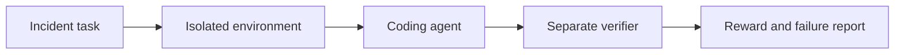

# InfraLab-Bench

**A reproducible benchmark for evaluating coding agents on production-style AI infrastructure and MLOps failures.**

InfraLab-Bench is a planned suite of containerised terminal tasks in which coding agents diagnose and repair deliberately broken AI systems. Each task is designed to be unambiguous, reproducible, and verifiable with a deterministic binary reward.

> **Project status:** design and initial implementation. The first milestone will prove the format with two complete tasks before the benchmark expands.

## Development

The repository currently contains the benchmark design, documentation, Python package
foundation, and test scaffolding. Benchmark tasks, runners, validators, and reporting
features will be added incrementally as the task format is proven.

Set up a local development environment:

```bash
python -m venv .venv
source .venv/bin/activate
python -m pip install --upgrade pip
python -m pip install -e ".[dev]"
```

Run the current checks:

```bash
ruff check .
pytest
python -m compileall -q src tests
```

## Why this project exists

Existing benchmarks have made repository-level software repair and general terminal work measurable. InfraLab-Bench focuses on a narrower gap: whether an agent can investigate and repair realistic failures across AI applications, containers, CI/CD, infrastructure as code, ML pipelines, and observability.

The benchmark is intended to make more than pass rates visible. It will connect task design, isolated execution, behavioural verification, run telemetry, expert review, and failure analysis in one reproducible workflow.

## Core design

Every benchmark task will contain:

- a precise incident report and required end state;
- a deliberately broken application or infrastructure configuration;
- a pinned, isolated container environment that runs without internet access;
- an expert-written reference solution used for validation;
- a behavioural verifier kept outside the agent environment;
- an official binary reward: `1` only when every required condition passes, otherwise `0`;
- run metadata and a captured agent trajectory for failure analysis.



InfraLab-Bench will target compatibility with [Harbor](https://github.com/harbor-framework/harbor), allowing established coding agents to run against the task suite without a custom agent harness. The original contribution of this repository will be its production-style task suite, verifier quality controls, evaluation protocol, and failure analysis.

## Planned task catalogue

The pilot benchmark will grow from two proof-of-format tasks to eight reviewed tasks across six capability areas.

| Task | Broken system | Capability tested | Milestone |
|---|---|---|---|
| `api-schema-regression` | FastAPI inference service returns an incompatible prediction schema | Code tracing and regression repair | MVP |
| `ci-false-green` | CI reports success although the test suite never runs | CI investigation and verifier awareness | MVP |
| `model-artifact-mismatch` | Service loads the wrong model version or checksum | Artefact and dependency diagnosis | Pilot |
| `docker-nonroot-failure` | Inference service fails after security hardening | Docker permissions and secure deployment | Pilot |
| `terraform-iam-repair` | ML deployment role is broken and over-permissive | Terraform, IAM, and security reasoning | Pilot |
| `pipeline-data-leakage` | Training pipeline leaks validation data | ML correctness and evaluation integrity | Pilot |
| `observability-blackout` | A healthy-looking service has missing or misleading metrics | Monitoring and production debugging | Pilot |
| `dependency-upgrade-regression` | A library upgrade breaks inference for a specific input | Compatibility analysis and robust testing | Pilot |

Real cloud credentials will not be required. AWS behaviour will be represented with LocalStack, generated fixtures, mocked services, or policy tests so every task can run locally and in CI.

## Reward and diagnostics

The official score remains simple and reproducible:

```text
1 = every required behavioural condition passed
0 = one or more required conditions failed
```

No LLM judge will determine the final reward. Additional fields may explain a failed run without changing its score:

```json
{
  "reward": 0,
  "passed_assertions": 7,
  "total_assertions": 9,
  "runtime_seconds": 614,
  "failure_stage": "verification",
  "regression_detected": true
}
```

## Evaluation principles

- Verify observable behaviour rather than a specific implementation.
- Keep verifier tests and reference solutions outside the agent container.
- Pin dependencies and container images.
- Run tasks without internet access and declare resource limits.
- Confirm the untouched environment earns `0` and the oracle solution earns `1`.
- Test plausible incorrect solutions and evaluator-tampering attempts.
- Run each evaluated agent three times per task.
- Report uncertainty rather than ranking agents from a single attempt.
- Version tasks, environments, agents, models, and benchmark releases.

The main reported measures will be pass rate, category pass rate, median completion time, median terminal actions, estimated model cost where available, regression rate, failure distribution, and 95% confidence intervals for pass rates.

## Planned repository structure

The implementation will grow into the following structure as each component becomes real:

```text
infralab-bench/
├── README.md
├── docs/
│   └── BUILDING.md
├── tasks/
│   └── <task-id>/
│       ├── instruction.md
│       ├── task.toml
│       ├── environment/
│       ├── solution/
│       └── tests/
├── src/infralab_bench/
├── analysis/
├── results/
├── scripts/
├── tests/
└── .github/workflows/
```

## Build roadmap

1. Prove the format with `api-schema-regression` and `ci-false-green`.
2. Add the validation, execution, telemetry, and reporting core.
3. Expand to eight independently reviewed pilot tasks.
4. Evaluate an oracle, a lightweight baseline, and at least two coding agents.
5. Publish results, annotated failures, limitations, and a tagged `v0.1.0` pilot release.

The complete implementation sequence, task contract, review gates, metrics, and release criteria are in [docs/BUILDING.md](docs/BUILDING.md).

## Positioning

InfraLab-Bench is a pilot benchmark, not a claim of comprehensive model capability. Its initial goal is to establish a small number of rigorous evaluation primitives and tasks that are trustworthy, inspectable, and easy to reproduce.

## Related work

- [SWE-bench](https://www.swebench.com/SWE-bench/) evaluates agents on real GitHub software issues.
- [Terminal-Bench](https://github.com/harbor-framework/terminal-bench) evaluates agents on terminal-based tasks.
- [Harbor](https://github.com/harbor-framework/harbor) provides infrastructure for running agents against containerised tasks.

## Author

Designed and maintained by [Babasola Adeoye](https://github.com/sadeoye12) as a public demonstration of benchmark design, coding-agent evaluation, MLOps, reproducible experimentation, and failure analysis.
